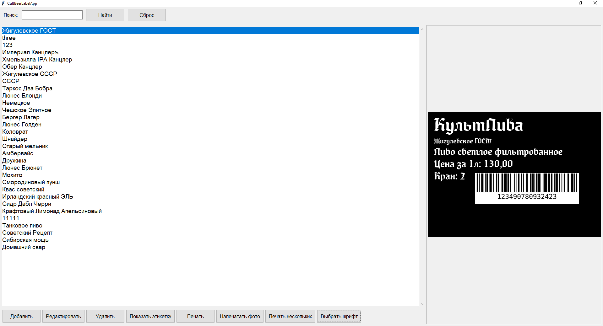
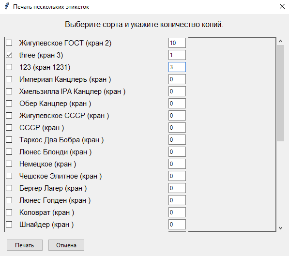
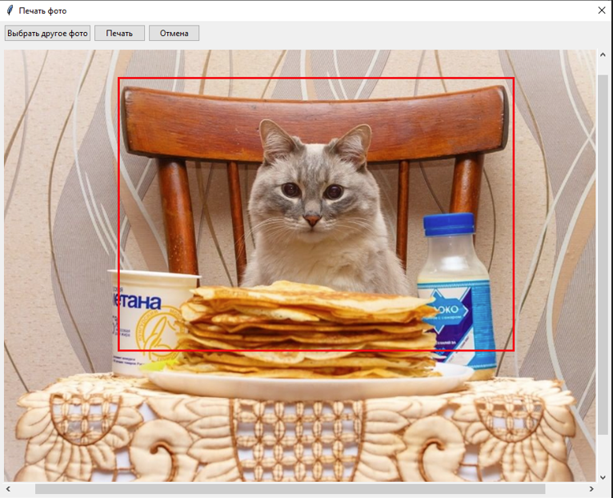
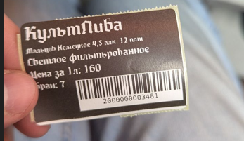
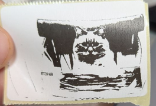

# Beer Label Printer

Десктопное приложение для управления базой данных сортов пива, генерации и печати этикеток на принтере Xprinter XP-365B (или любом другом Windows-принтере).  
Программа написана на Python с использованием Tkinter, PIL и win32print.







## Возможности

- Просмотр списка сортов пива с поиском по названию или типу
- Добавление нового сорта (название, тип, цена, приветствие)
- Удаление выбранного сорта
- Генерация этикетки 
- Предпросмотр этикетки перед печатью
- Печать этикетки на указанный принтер (по умолчанию Xprinter XP-365B)
- Выбор изображения или его части для печати 
- Выбор шрифта формата `.ttf`

## Системные требования

- Windows 7/8/10/11 (x86 или x64)
- Установленный Python 3.8+ (только для запуска из исходников)
- Принтер с драйвером для Windows (для печати)

## Запуск из исходного кода

1. Клонируйте репозиторий:
   ```bash
   git clone https://github.com/Kaktys36/beer_label_app.git
   cd beer_label_app
   ```

2. Установите зависимости:
    ```bash
    pip install pillow pywin32 pyinstaller
    ```
3. Убедитесь, что в папке с программой есть файлы шрифтов arial.ttf и arialbd.ttf (можно скопировать из C:\Windows\Fonts\).

4. Запустите приложение:
    ```bash
    python beer_label_app.py 
    ```

## Сборка в единый .exe файл
Для распространения программы без необходимости устанавливать Python можно собрать исполняемый файл с помощью PyInstaller.

## Подготовка
1. Скопируйте шрифты arial.ttf и arialbd.ttf из C:\Windows\Fonts\ в папку проекта.
2. Убедитесь, что все зависимости установлены (см. выше).

## Команда сборки
Выполните в командной строке (из папки проекта):
    ```
    pyinstaller --onefile --windowed --name "BeerLabelPrinter" --add-data "arial.ttf;." --add-data "arialbd.ttf;." --add_data "beer_icon.ico;." beer_label_app.py
    ```

## Пояснение ключей:

--onefile – упаковывает всё в один .exe.
--windowed – скрывает консольное окно (для GUI).
--name – имя выходного файла.
--add-data "arial.ttf;." – включает файл шрифта в архив и помещает его в корень временной папки при запуске.

Готовый .exe появится в папке dist.

## Важные замечания
Если вы используете другой принтер, измените переменную PRINTER_NAME в коде перед сборкой (строка PRINTER_NAME = "Xprinter XP-365B").
Для работы на 32-битных системах собирайте с помощью 32-битной версии Python.

## Использование готового .exe
Перенесите beer_label_app.exe на любой компьютер с Windows.

Запустите файл. При первом запуске в той же папке автоматически создастся файл данных beers_data.json. Также можно поместить json с сортами в папку с exe файлом и они появятся в программе.

## Возможные проблемы
1. Принтер не найден
Проверьте название принтера в системе (Панель управления → Устройства и принтеры) и при необходимости измените переменную PRINTER_NAME в коде перед сборкой.

2. Шрифты не загружаются
Убедитесь, что файлы arial.ttf и arialbd.ttf присутствуют в папке с программой (или внутри .exe). При запуске из .exe они извлекаются автоматически.

3. Программа не запускается на старых Windows
Собирайте .exe с помощью 32-битной версии Python. Убедитесь, что установлены все необходимые библиотеки Visual C++ Redistributable.

## Лицензия
MIT License. Используйте свободно в личных и коммерческих целях с указанием авторства.

## При возникновении вопросов, а также для сотрудничества пишите в тг @KiloLex

Приятного использования! 🍻
